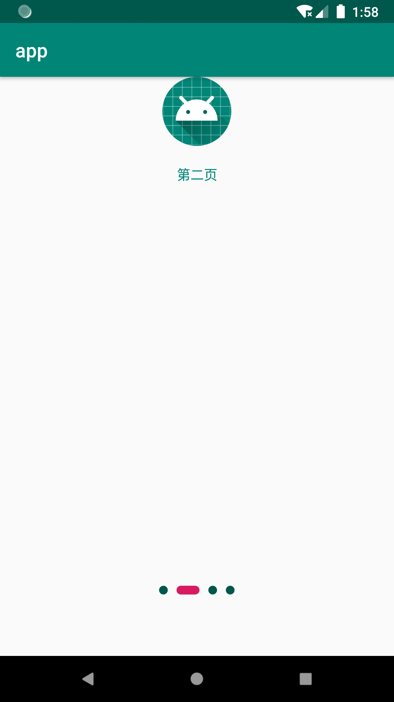
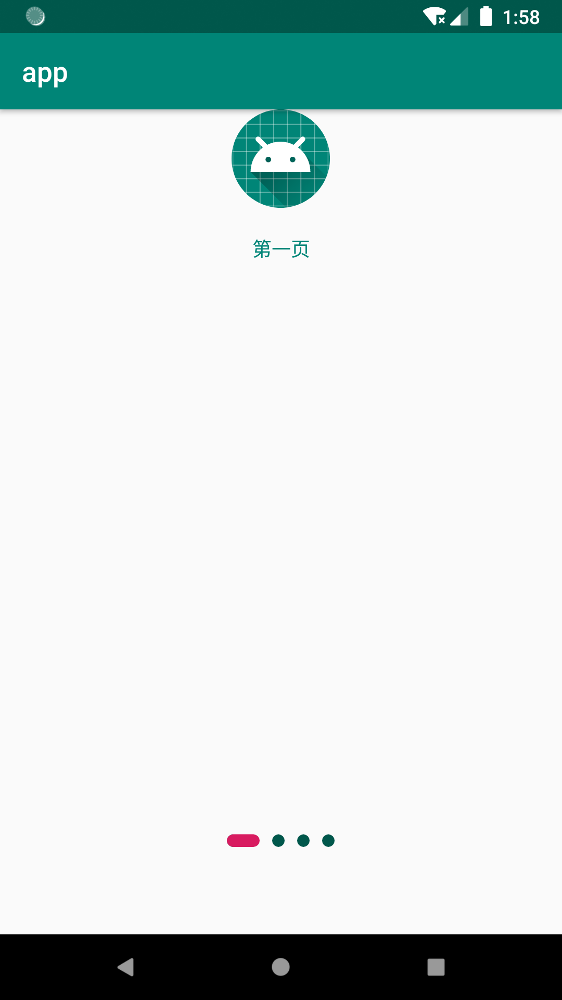

# PagerIndicatorView

1、[体验demo](../apk)

2、`截图`
 

3、`改变`

* 不再添加额外的属性文件
* 可以滑动的点可以修改宽高
* 点之间的距离永远相等（正常的点之间，正常点和滑点之间的距离一致）

4、`使用`
  
 * 添加 jitpack仓库
    allprojects {
		repositories {
			...
			maven { url 'https://www.jitpack.io' }
		}
	}
	* 在gradle中引用库
	implementation 'com.github.zhaohe9981:PagerIndicatorView:v200'
	
    * 在布局文件中添加pagerindicator
    <com.xiaoniu.pagerindicator.PagerIndicatorView
            android:id="@+id/piv_indicator"
            android:layout_width="wrap_content"
            android:layout_height="wrap_content"
            android:layout_centerHorizontal="true"
            android:layout_alignParentBottom="true"
            android:layout_marginBottom="64dp"/>
            
     * PagerIndicatorView初始化：         
         pagerIndicatorView
                        .setCount(ids.size())
                        .setMargin(9)
                        .setNormalDotSize(9,9)
                        .setNormalDotColor(pagerIndicatorView.getContext().getResources().getColor(R.color.colorPrimaryDark))
        //                .setScrollDotWidth(9,9) //可以跟正常点的大小一样
                        .setScrollDotWidth(24,9)
                        .setScrollDotColor(pagerIndicatorView.getContext().getResources().getColor(R.color.colorAccent))
                        .show();
  
 * PagerIndicatorView的选中图片随着viewpager的滚动而移动： 
 
    viewPager.addOnPageChangeListener(new ViewPager.OnPageChangeListener() {
               @Override
               public void onPageScrolled(int position, float positionOffset, int positionOffsetPixels) {
                   pagerIndicatorView.onPageScrolled(position, positionOffset);
               }
   
               @Override
               public void onPageSelected(int position) {
          
               }
   
               @Override
               public void onPageScrollStateChanged(int state) {
   
               }
           });